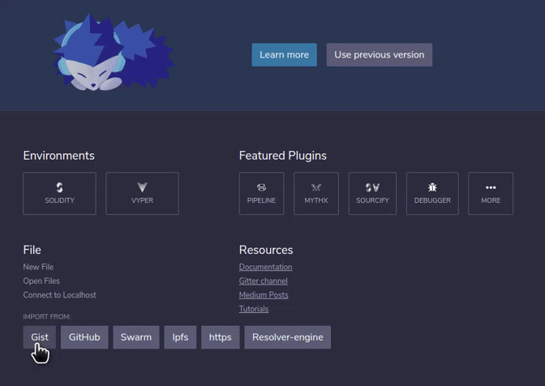
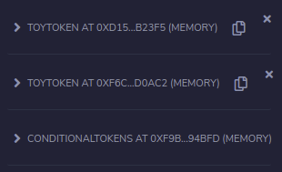

    <iframe class="resp-iframe" src="https://www.youtube-nocookie.com/embed/uZNWq07Y4Ag?start=141" frameborder="0" allow="accelerometer; autoplay; encrypted-media; gyroscope; picture-in-picture" allowfullscreen></iframe>

---
## Import to Remix
To begin, navigate to [remix](https://remix.ethereum.org) and import this [gist](https://gist.github.com/cag/65dc3ddfa03f067dd41ca7121ee3120f).

This gist will result in three files being imported into your remix IDE.

Let's take a look at the files first.
* CT Helpers is a library, which implements helper routines for the conditional tokens contracts. We won't be going too much into detail about the implementations done here, but this is required by the conditional tokens contract.
* The conditional tokens contract here is actually adapted from the canonical [version](https://etherscan.io/address/0xC59b0e4De5F1248C1140964E0fF287B192407E0C#code) to use [Open Zeppelins new ERC1155 implementation](https://docs.openzeppelin.com/contracts/3.x/erc1155), so it actually differs a little from the [canonical version](https://etherscan.io/address/0xC59b0e4De5F1248C1140964E0fF287B192407E0C#code).
* Finally, the gist contains a `tutorial.sol` source file. This source file imports the conditional tokens contract as well as an ERC20 based contract from Open Zeppelin. This base contract is used to implement a toy token that can be minted by any address and is used to illustrate how ERC20 tokens interact with the conditional tokens contracts.

Once you have imported the gist, go to the "solidity compiler" module and compile `tutorial.sol` using any solidity 0.6 compiler.

Then go to the "deploy and run" module and deploy `tutorial.sol` to your preferred network.

The canonical addresses for the contracts on some existing networks:
* Rinkeby: `0x36bede640D19981A82090519bC1626249984c908`
* Mainnet: `0xC59b0e4De5F1248C1140964E0fF287B192407E0C`

## Deploy ERC20 Tokens
Let's begin by creating a couple of ERC20 toy tokens to illustrate how different ERC20 tokens can be used with the same conditional tokens contracts.

In the "deploy and run" module, deploy two instances of the `ToyToken`. You can give them any name and symbol you like, just make them unqique so that we can reference them later.

## Deploy Conditional Tokens contracts
Now deploy an instance of the conditional tokens contract (you may need to increase the gas limit to ~6,500,000 or more), or load it from a previously deployed address if you have already deployed it on your selected network previously.

The bottom of "deploy and run" module should look something like this:

---

Next we'll learn how to create a condition.
